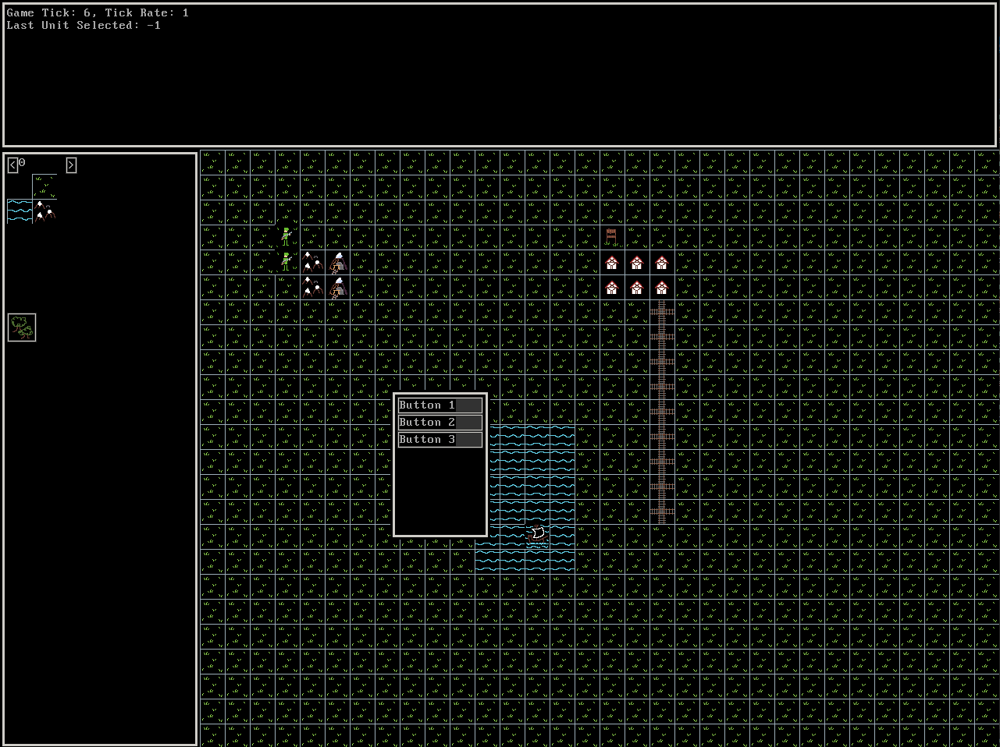
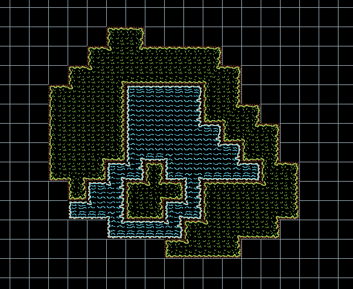
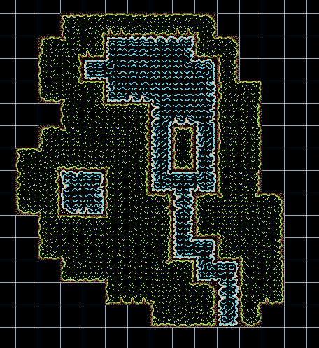

# frontier
A game engine for Retro-style strategy games.

Currently Working On: Improving Graphics by creating a system which places suitable graphics in a tile based on the tile's neighbors. 
I believe the technique I will use is known as "Wang Blob Tiles"

And here I've added a way to have multiple variants of the subtiles which construct the Wang Blob Tile graphics.
You can see some of the subtile variants along the top water edge.

## Features:
 - Software Rendered
 - Camera Movment and Zoom levels.
 - Viewport Clipping (game map elements outside of the game window are not drawn)
 - Transparency (by discarding pixels with 0 in alpha channel)
 - UI Elements : Rectangles, Images, ASCII Text (w/ text and background coloring), Buttons, Tilemaps, Game Window
 - Game Map Editing
 - Unit Movement, Attacking, State Menu
 - Program & Game Settings loaded from Json
 - Cycle Counters for performance analysis
 
### Feature Showcases:
- Software Rendering & Camera Movement: https://youtu.be/LpRilZxemBQ
- Initial UI & Unit Movement: https://youtu.be/of5REwYvzBI
- Unit Combat: https://youtu.be/89JbdbfRlow
- Tilemap Editing: https://youtu.be/sTUpxr7p5C8
- Tilemap Editing with Different Tilesets: https://youtu.be/KST4Q0XWDps
- Wang Blob Tiles for pretty transitions between tile types: https://youtu.be/zu53zhWPZ2Y

## Goals (in no particular order):
- Improvements to UI Text Layout
- Game Map Saving & Loading
- Unit Saving & Loading
- Unit Placement
- Program & Game Settings Saving
- UI Anchors to improve Layout
